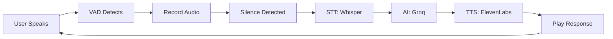
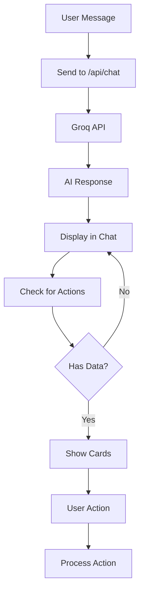
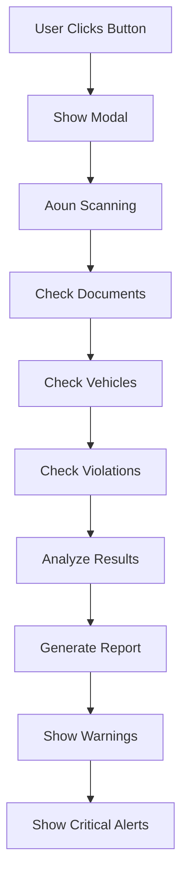

# 🇸🇦 Absher Hackathon - Aoun AI Assistant

<div align="center">


**عون - المساعد الذكي للخدمات الحكومية السعودية**

[](https://nextjs.org/)
[](https://www.typescriptlang.org/)
[](https://fastapi.tiangolo.com/)
[](https://tailwindcss.com/)

**المساعد الذكي الذي يجعل الخدمات الحكومية أسهل وأسرع**

[المميزات](#-المميزات) • [التقنيات](#-التقنيات-المستخدمة) • [البدء السريع](#-البدء-السريع) • [الهيكل](#-هيكل-المشروع)

</div>

---

## 📋 جدول المحتويات

- [نظرة عامة](#-نظرة-عامة)
- [المميزات](#-المميزات)
- [التقنيات المستخدمة](#-التقنيات-المستخدمة)
- [الهيكل](#-هيكل-المشروع)
- [البدء السريع](#-البدء-السريع)
- [إعداد البيئة](#-إعداد-البيئة)
- [Workflow الميزات](#-workflow-الميزات)
- [API Documentation](#-api-documentation)
- [المساهمة](#-المساهمة)

---

## 🌟 نظرة عامة

**عون (Aoun)** هو مساعد ذكي متكامل تم تطويره لمنصة أبشر الحكومية السعودية. يوفر للمواطنين وصولاً سلساً للخدمات الحكومية من خلال المحادثة النصية والصوتية.

### 🎯 الرؤية:
- 🤖 **ذكاء اصطناعي متقدم**: استخدام Groq LLaMA 3.3 للفهم الطبيعي
- 🎤 **تفاعل صوتي كامل**: TTS (ElevenLabs) + STT (OpenAI Whisper)
- 📊 **تكامل شامل**: فحص الوضع الحكومي، المخالفات، الوثائق
- 🇸🇦 **مصمم للعربية**: واجهة RTL محسّنة بالكامل

---

## ✨ المميزات

### 🗣️ **المساعد الصوتي (Voice Agent)**
```
┌─────────────────────────────────────────┐
│  المستخدم يتحدث → STT (Whisper)        │
│         ↓                                │
│  AI Processing (Groq)                    │
│         ↓                                │
│  TTS (ElevenLabs) → الصوت العربي        │
│         ↓                                │
│  VAD → كشف الصوت التلقائي                │
└─────────────────────────────────────────┘
```

- ✅ **Text-to-Speech**: ElevenLabs API بصوت عربي متعدد اللغات
- ✅ **Speech-to-Text**: OpenAI Whisper للتحويل الدقيق
- ✅ **Voice Activity Detection**: كشف تلقائي للصمت
- ✅ **حلقة محادثة مستمرة**: تفاعل طبيعي بدون توقف

### 💬 **المحادثة الذكية (Chat Interface)**
- ✅ **استجابات AI حقيقية**: مدعومة بـ Groq LLaMA 3.3 (70B)
- ✅ **فهم السياق**: يحتفظ بسجل المحادثة
- ✅ **تكامل البيانات**: الوصول للمخالفات، الوثائق، المركبات
- ✅ **إجراءات سريعة**: دفع الغرامات، تقديم اعتراضات

### 🔍 **فحص الوضع الحكومي (Health Check)**
```
┌─────────────────────────────────────────┐
│  عون يفحص:                              │
│  • الوثائق الرسمية                      │
│  • المركبات والتأمين                    │
│  • المخالفات والغرامات                  │
│  • التحذيرات قبل أن تصبح غرامة          │
└─────────────────────────────────────────┘
```

- ✅ **فحص شامل**: جميع الخدمات الحكومية في مكان واحد
- ✅ **تنبيهات ذكية**: تحذيرات قبل انتهاء الصلاحيات
- ✅ **تقرير تفصيلي**: عرض كامل للحالة

### 📦 **رحلات الحياة (Life Event Bundles)**
- ✅ **حزمة الزواج**: إتمام جميع إجراءات الزواج
- ✅ **حزمة شراء سيارة**: تسجيل، تأمين، رخصة
- ✅ **تتبع الخطوات**: عرض مرئي للتقدم

---

## 🛠️ التقنيات المستخدمة

### **Frontend**
```
┌─────────────────────────────────────┐
│  Next.js 15 (React 19)              │
│  TypeScript 5                        │
│  Tailwind CSS                        │
│  Lucide React (Icons)                │
│  Cairo, Tajawal (Fonts)              │
└─────────────────────────────────────┘
```

### **Backend**
```
┌─────────────────────────────────────┐
│  FastAPI (Python)                   │
│  SQLModel + PostgreSQL               │
│  JWT + bcrypt (Auth)                │
│  RESTful API                         │
└─────────────────────────────────────┘
```

### **AI & Voice Services**
```
┌─────────────────────────────────────┐
│  🤖 Groq (LLaMA 3.3 70B)            │
│     → AI Chat Responses              │
│                                      │
│  🔊 ElevenLabs (Multilingual v2)     │
│     → Text-to-Speech (Arabic)       │
│                                      │
│  🎤 OpenAI Whisper                  │
│     → Speech-to-Text (Arabic)        │
└─────────────────────────────────────┘
```

### **DevOps**
- Git & GitHub
- npm/pnpm
- Node.js 18+, Python 3.11+

---

## 📁 هيكل المشروع

```
Absher-Kackathon/
├── front-end/
│   └── clone-website-ui/
│       ├── app/
│       │   ├── api/
│       │   │   ├── chat/          # Groq AI endpoint
│       │   │   ├── tts/           # ElevenLabs TTS
│       │   │   └── voice/         # OpenAI Whisper STT
│       │   ├── page.tsx           # Main page
│       │   └── globals.css        # Global styles
│       ├── components/
│       │   ├── AounChat.tsx       # Chat interface
│       │   ├── VoiceCallPanel.tsx # Voice agent
│       │   ├── HealthCheckModal.tsx # Health check
│       │   └── LifeEventBundles.tsx # Life events
│       ├── utils/
│       │   └── speak.ts           # TTS utilities
│       ├── data/                   # JSON data files
│       └── public/
│           └── aoun.png            # Aoun avatar
├── backend/
│   ├── main.py                    # FastAPI app
│   ├── models.py                  # Database models
│   └── api/                       # API routes
└── README.md
```

---

## 🚀 البدء السريع

### **المتطلبات الأساسية**
- Node.js 18+
- Python 3.11+
- npm أو pnpm
- Git

### **1. Clone المشروع**
```bash
git clone https://github.com/ZiyadALharbi/Absher-Kackathon.git
cd Absher-Kackathon
```

### **2. إعداد Frontend**
```bash
cd front-end/clone-website-ui
npm install
# أو
pnpm install
```

### **3. إعداد Backend (اختياري)**
```bash
cd backend
python -m venv venv
venv\Scripts\activate  # Windows
# source venv/bin/activate  # Linux/Mac
pip install -r requirements.txt
```

### **4. إعداد متغيرات البيئة**

**⚠️ مهم:** انسخ ملف `.env.example` إلى `.env.local`:

```bash
# Frontend
cd front-end/clone-website-ui
cp .env.example .env.local
```

**عدّل `.env.local` وأضف API Keys:**

```env
# Groq API Key (للذكاء الاصطناعي)
GROQ_API_KEY=your_groq_api_key_here

# ElevenLabs API Key (للصوت العربي)
ELEVENLABS_API_KEY=your_elevenlabs_api_key_here

# OpenAI API Key (للتحويل الصوتي)
OPENAI_API_KEY=your_openai_api_key_here

# App URL
NEXT_PUBLIC_APP_URL=http://localhost:3000
```

### **5. تشغيل المشروع**

**Terminal 1 - Frontend:**
```bash
cd front-end/clone-website-ui
npm run dev
```

**Terminal 2 - Backend (اختياري):**
```bash
cd backend
python -m uvicorn main:app --reload --port 8000
```

### **6. افتح المتصفح**
```
http://localhost:3000
```

---

## 🔑 الحصول على API Keys

### **1. Groq API Key** (للذكاء الاصطناعي)
```
1. اذهب إلى: https://console.groq.com
2. سجل حساب جديد
3. احصل على API Key
4. Model: llama-3.3-70b-versatile
```

### **2. ElevenLabs API Key** (للصوت)
```
1. اذهب إلى: https://elevenlabs.io
2. سجل حساب جديد
3. احصل على API Key
4. Voice ID: 3nav5pHC1EYvWOd5LmnA
```

### **3. OpenAI API Key** (للتحويل الصوتي)
```
1. اذهب إلى: https://platform.openai.com
2. سجل حساب جديد
3. احصل على API Key
4. Model: whisper-1
```

---

## 🔄 Workflow الميزات

### **1. Voice Agent Workflow**



**التفاصيل:**
1. **VAD** يكتشف الصوت تلقائياً
2. **التسجيل** يتوقف بعد ثانية من الصمت
3. **Whisper** يحول الصوت إلى نص
4. **Groq** يولد الرد
5. **ElevenLabs** يحول النص إلى صوت عربي
6. **التكرار** تلقائياً

### **2. Chat Workflow**



### **3. Health Check Workflow**



**الخطوات:**
1. فحص البيانات الشخصية
2. فحص الوثائق الرسمية
3. فحص المركبات والتأمين
4. فحص المخالفات والغرامات
5. تحليل النتائج
6. عرض التقرير

---

## 📡 API Documentation

### **Chat Endpoint**
```http
POST /api/chat
Content-Type: application/json

{
  "message": "ما هي مخالفاتي؟",
  "conversationHistory": []
}

Response:
{
  "response": "لديك 3 مخالفات مرورية..."
}
```

### **TTS Endpoint**
```http
POST /api/tts
Content-Type: application/json

{
  "text": "مرحباً بك في أبشر"
}

Response: audio/mpeg
```

### **STT Endpoint**
```http
POST /api/voice
Content-Type: multipart/form-data

audio: <audio-file.webm>

Response:
{
  "text": "ما هي مخالفاتي؟"
}
```

---

## 🎨 Design System

### **الألوان**
```css
Primary:     #00663D (Dark Green)
Primary Light: #008850
Primary Dark:  #004A2C
Surface:     #F7F7F7
Border:      #E4E4E7
Error:       #721c24
Warning:     #856404
```

### **الخطوط**
- **عربي**: Cairo, Tajawal
- **إنجليزي**: Geist, Source Sans Pro

---

## 🐛 Debugging

### **تفعيل Logs المفصلة**

افتح Browser Console (F12) وستجد logs مثل:

```
═══════════════════════════════════════════
🎬 [VoiceCall] Component mounted
═══════════════════════════════════════════
🔊 [speakArabic] Starting playback...
✅ [speakArabic] Playback started
▶️ [Recording] startRecording() called
📝 [STT] Transcription successful
🤖 [AI] Getting AI response
💬 [AI] Response: لديك 3 مخالفات...
```

---

## 📊 Project Statistics

```
Total Files:     150+
Lines of Code:   15,000+
Components:      20+
API Routes:      5+
Features:        6+
```

---

## 🤝 المساهمة

نرحب بالمساهمات! يرجى اتباع الخطوات:

1. Fork المشروع
2. إنشاء branch (`git checkout -b feature/AmazingFeature`)
3. Commit التغييرات (`git commit -m 'Add AmazingFeature'`)
4. Push إلى branch (`git push origin feature/AmazingFeature`)
5. فتح Pull Request

---

## 📝 License

تم تطوير هذا المشروع لـ **Absher Hackathon** - وزارة الداخلية السعودية

---

## 👥 Team

تم التطوير بـ ❤️ لصالح:
- **وزارة الداخلية** - المملكة العربية السعودية
- **رؤية 2030** - التحول الرقمي

---

## 🙏 Acknowledgments

- **Ministry of Interior** - منصة أبشر
- **Groq** - AI Inference
- **ElevenLabs** - Text-to-Speech
- **OpenAI** - Whisper STT

---

## 📞 Support

للأسئلة أو الدعم:
- افتح Issue على GitHub
- تواصل مع الفريق

---

<div align="center">

**صُنع بـ ❤️ للمملكة العربية السعودية 🇸🇦**

**عون - جعل الخدمات الحكومية أسهل**

</div>
