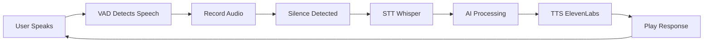

# 🇸🇦 Absher Hackathon - Aoun AI Assistant

<div align="center">


**المساعد الذكي للخدمات الحكومية السعودية**

[](https://nextjs.org/)
[](https://www.typescriptlang.org/)
[](https://fastapi.tiangolo.com/)
[](https://tailwindcss.com/)

</div>

---

## 📋 Table of Contents

- [Overview](#-overview)
- [Features](#-features)
- [Tech Stack](#-tech-stack)
- [Project Structure](#-project-structure)
- [Installation](#-installation)
- [Environment Variables](#-environment-variables)
- [Usage](#-usage)
- [Voice Agent](#-voice-agent)
- [API Documentation](#-api-documentation)
- [Contributing](#-contributing)
- [License](#-license)

---

## 🌟 Overview

**عون (Aoun)** is an intelligent AI assistant developed for the Saudi Arabian government's Absher platform. It provides citizens with seamless access to government services through text chat and voice interactions.

### 🎯 Key Capabilities:
- 🤖 **AI-Powered Chat**: Natural language understanding using Groq LLaMA 3.3
- 🎤 **Voice Agent**: Full voice interaction with TTS (ElevenLabs) & STT (OpenAI Whisper)
- 📊 **Service Integration**: Check violations, manage documents, handle life events
- 🇸🇦 **Arabic-First**: Fully optimized for Arabic language and RTL layout

---

## ✨ Features

### 🗣️ Voice Agent (المكالمة الصوتية)
- ✅ **Text-to-Speech (TTS)**: ElevenLabs API with Arabic multilingual voice
- ✅ **Speech-to-Text (STT)**: OpenAI Whisper for accurate Arabic transcription
- ✅ **Voice Activity Detection (VAD)**: Automatic silence detection
- ✅ **Auto-Stop on Silence**: Stops recording after 1 second of silence
- ✅ **Conversation Loop**: Continuous back-and-forth interaction
- ✅ **Echo Cancellation**: Enhanced audio processing

### 💬 Chat Interface (المحادثة)
- ✅ **Real AI Responses**: Powered by Groq LLaMA 3.3 (70B parameters)
- ✅ **Context Awareness**: Maintains conversation history
- ✅ **Data Integration**: Access to violations, documents, vehicles
- ✅ **Quick Actions**: Pay fines, submit appeals, request services

### 📦 Life Event Bundles (حزم الأحداث الحياتية)
- ✅ **Marriage Package**: Complete all marriage-related procedures
- ✅ **Car Purchase Package**: Vehicle registration, insurance, license
- ✅ **Step-by-Step Progress**: Visual progress tracking

### 🔍 Smart Search (البحث الذكي)
- ✅ **Service Discovery**: Find government services quickly
- ✅ **Natural Language**: Search in Arabic naturally
- ✅ **Auto-Complete**: Smart suggestions

### 🎨 Modern UI/UX
- ✅ **Professional Design**: Dark green theme (#00663D)
- ✅ **RTL Support**: Full right-to-left layout
- ✅ **Responsive**: Works on all devices
- ✅ **Accessibility**: WCAG compliant
- ✅ **Smooth Animations**: Beautiful hover effects

---

## 🛠️ Tech Stack

### Frontend
- **Framework**: Next.js 15 (React 19)
- **Language**: TypeScript 5
- **Styling**: Tailwind CSS
- **Icons**: Lucide React
- **Fonts**: Cairo, Tajawal (Arabic optimized)

### Backend
- **Framework**: FastAPI (Python)
- **Database**: SQLModel + PostgreSQL
- **Authentication**: JWT + bcrypt
- **API**: RESTful

### AI Services
- **LLM**: Groq (LLaMA 3.3 70B)
- **TTS**: ElevenLabs (Multilingual v2)
- **STT**: OpenAI Whisper
- **Voice ID**: `3nav5pHC1EYvWOd5LmnA`

### DevOps
- **Version Control**: Git
- **Package Manager**: npm/pnpm
- **Environment**: Node.js 18+, Python 3.11+

---

## 📁 Project Structure

```
Absher-Kackathon/
├── front-end/
│   └── clone-website-ui/
│       ├── app/
│       │   ├── api/
│       │   │   ├── chat/          # AI chat endpoint
│       │   │   ├── tts/           # Text-to-Speech
│       │   │   ├── voice/         # Speech-to-Text
│       │   │   └── test-tts/      # TTS testing
│       │   ├── page.tsx           # Main page
│       │   └── globals.css        # Global styles
│       ├── components/
│       │   ├── AounChat.tsx       # Chat interface
│       │   ├── AounChatButton.tsx # Floating chat button
│       │   ├── VoiceCallPanel.tsx # Voice agent UI
│       │   ├── VoiceCallButton.tsx# Floating voice button
│       │   ├── LifeEventBundles.tsx
│       │   ├── header.tsx
│       │   ├── footer.tsx
│       │   └── ...
│       ├── utils/
│       │   └── speak.ts           # TTS utilities
│       ├── data/
│       │   ├── violations.json
│       │   ├── profile.json
│       │   └── ...
│       └── public/
│           ├── absher-logo.svg
│           ├── moi-2030-logos.png
│           └── test-tts.html      # TTS testing page
├── backend/
│   ├── main.py                    # FastAPI app
│   ├── models.py                  # Database models
│   ├── api/                       # API routes
│   └── requirements.txt
├── README.md
└── .gitignore
```

---

## 🚀 Installation

### Prerequisites
- Node.js 18+ 
- Python 3.11+
- npm or pnpm
- Git

### 1️⃣ Clone the Repository
```bash
git clone <repository-url>
cd Absher-Kackathon
```

### 2️⃣ Backend Setup
```bash
cd backend
python -m venv venv
venv\Scripts\activate  # Windows
# source venv/bin/activate  # Linux/Mac
pip install -r requirements.txt
```

### 3️⃣ Frontend Setup
```bash
cd front-end/clone-website-ui
npm install
# or
pnpm install
```

### 4️⃣ Environment Variables
Create `.env.local` in `front-end/clone-website-ui/`:

```env
GROQ_API_KEY=your_groq_api_key
ELEVENLABS_API_KEY=your_elevenlabs_api_key
OPENAI_API_KEY=your_openai_api_key
NEXT_PUBLIC_APP_URL=http://localhost:3000
```

---

## 🔑 Environment Variables

### Required API Keys

#### 1. **Groq API Key**
- Get from: [https://console.groq.com](https://console.groq.com)
- Model: `llama-3.3-70b-versatile`
- Usage: AI chat responses

#### 2. **ElevenLabs API Key**
- Get from: [https://elevenlabs.io](https://elevenlabs.io)
- Voice ID: `3nav5pHC1EYvWOd5LmnA`
- Model: `eleven_multilingual_v2`
- Usage: Text-to-Speech (Arabic)

#### 3. **OpenAI API Key**
- Get from: [https://platform.openai.com](https://platform.openai.com)
- Model: `whisper-1`
- Usage: Speech-to-Text (Arabic)

---

## 💻 Usage

### Start Backend (Terminal 1)
```bash
cd backend
python -m uvicorn main:app --reload --host 0.0.0.0 --port 8000
```
Backend will run on: `http://localhost:8000`

### Start Frontend (Terminal 2)
```bash
cd front-end/clone-website-ui
npm run dev
```
Frontend will run on: `http://localhost:3000`

### Access the Application
- **Main App**: [http://localhost:3000](http://localhost:3000)
- **TTS Test Page**: [http://localhost:3000/test-tts.html](http://localhost:3000/test-tts.html)
- **API Docs**: [http://localhost:8000/docs](http://localhost:8000/docs)

---

## 🎤 Voice Agent

### How It Works



### Configuration

#### Voice Activity Detection (VAD)
```typescript
{
  fftSize: 2048,
  smoothingTimeConstant: 0.8,
  voiceThreshold: 5,
  silenceDuration: 1000,  // 1 second
  maxRecordingTime: 6000  // 6 seconds
}
```

#### Audio Settings
```typescript
{
  echoCancellation: true,
  noiseSuppression: true,
  autoGainControl: true,
  sampleRate: 48000,
  channelCount: 1
}
```

#### TTS Settings
```json
{
  "voice_id": "3nav5pHC1EYvWOd5LmnA",
  "model_id": "eleven_multilingual_v2",
  "voice_settings": {
    "stability": 0.5,
    "similarity_boost": 0.75,
    "speed": 1.2
  }
}
```

---

## 📡 API Documentation

### Chat Endpoint
```http
POST /api/chat
Content-Type: application/json

{
  "message": "ما هي مخالفاتي؟",
  "conversationHistory": []
}
```

### TTS Endpoint
```http
POST /api/tts
Content-Type: application/json

{
  "text": "مرحباً بك في أبشر"
}
```

### STT Endpoint
```http
POST /api/voice
Content-Type: multipart/form-data

audio: <audio-file.webm>
```

---

## 🐛 Debugging

### Enable Detailed Logs

The voice agent includes comprehensive logging:

```javascript
// Open Browser Console (F12)
// You'll see logs like:

═══════════════════════════════════════════
🎬 [VoiceCall] Component mounted
═══════════════════════════════════════════
🔊 [speakArabic] Starting playback...
✅ [speakArabic] Playback started
▶️ [Recording] startRecording() called
🎤 [Recording] Current isSpeaking: false
✅ [Recording] MediaRecorder started
📝 [STT] Transcription successful
🤖 [AI] Getting AI response
💬 [AI] Response: لديك 3 مخالفات...
```

### Testing TTS
Visit: `http://localhost:3000/test-tts.html`

---

## 🎨 Design System

### Colors
- **Primary**: `#00663D` (Dark Green)
- **Primary Light**: `#008850`
- **Primary Dark**: `#004A2C`
- **Surface**: `#F7F7F7`
- **Border**: `#E4E4E7`
- **Error**: `#DC2626`

### Typography
- **Arabic Font**: Cairo, Tajawal
- **Sizes**: 
  - Headers: `text-xl` to `text-2xl` (20px-24px)
  - Body: `text-base` (16px)
  - Small: `text-sm` (14px)

### Spacing
- **Base**: 4px (0.25rem)
- **Components**: 16px-24px (1rem-1.5rem)
- **Sections**: 32px-48px (2rem-3rem)

---

## 🤝 Contributing

We welcome contributions! Please follow these steps:

1. Fork the repository
2. Create a feature branch (`git checkout -b feature/AmazingFeature`)
3. Commit your changes (`git commit -m 'Add some AmazingFeature'`)
4. Push to the branch (`git push origin feature/AmazingFeature`)
5. Open a Pull Request

### Code Style
- Use TypeScript for frontend
- Follow ESLint rules
- Use Prettier for formatting
- Write meaningful commit messages
- Add comments for complex logic

---

## 📝 License

This project was developed for the Saudi Arabian Absher Hackathon.

---

## 👥 Team

Developed with ❤️ for the Ministry of Interior - Kingdom of Saudi Arabia

---

## 📞 Contact & Support

For issues, questions, or support:
- Open an issue on GitHub
- Contact the development team

---

## 🙏 Acknowledgments

- **Ministry of Interior** - For the Absher platform
- **Vision 2030** - For digital transformation initiatives
- **Groq** - For AI inference
- **ElevenLabs** - For TTS services
- **OpenAI** - For Whisper STT

---

<div align="center">

**Made with ❤️ for Saudi Arabia 🇸🇦**

</div>
